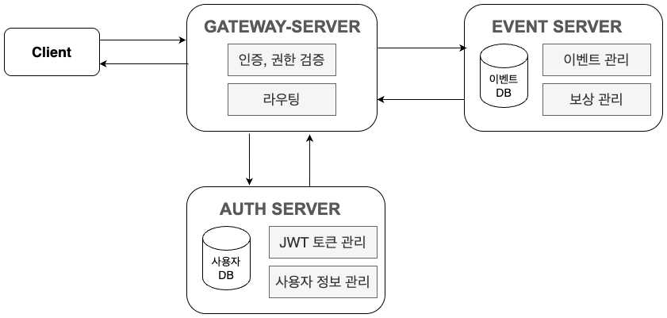

# event-reward-platform

## 📌 프로젝트 개요

이 프로젝트는 **MSA(Microservices Architecture)** 기반의 **이벤트 및 보상 관리 시스템**으로, 관리자는 이벤트를 생성하고 보상을 등록할 수 있으며, 사용자는 특정 이벤트에 대한 보상을 요청할 수 있습니다. 또한 보상 요청 내역을 조회하고 상태를 관리할 수 있는 기능을 제공합니다.

---

## 🔍 아키텍처 구성



* **Gateway Server**: 모든 클라이언트 요청을 받아 내부 서버로 라우팅합니다.
* **Auth Server**: 사용자 인증 및 권한 관리를 담당합니다.
* **Event Server**: 이벤트와 보상 관련 CRUD 및 조회 기능을 담당합니다.

### 📌 서버 간 통신 구조

* Gateway Server를 통해 모든 요청이 수집되며, URI에 맞춰 Auth Server 또는 Event Server로 요청이 전달됩니다.
* 인증이 필요한 요청은 Gateway에서 JWT 인증을 거친 후 내부 서버로 전달됩니다.

---

## 📂 주요 기능

### 1️⃣ 인증 관리

| HTTP Method | URI | 설명 |       
| --- | --- |-----------| 
| **POST** | `/auth/login` | 로그인      | 


### 2️⃣ 사용자 관리

* 사용자를 관리할 수 있는 기능을 제공합니다.

| HTTP Method | URI           | 설명     | 권한 |
|-------------|---------------|--------| --- |
| **GET**     | `/users`      | 사용자 조회 |  `ADMIN` |
| **POST**    | `/users`      | 사용자 등록 |  `ADMIN` |
| **PATCH**   | `/users/:id`  | 사용자 수정 |  `ADMIN` |
| **DELETE**  | `/events/:id` | 사용자 삭제 | `ADMIN` |


### 3️⃣ 이벤트 관리

* 이벤트 생성, 조회, 수정, 삭제 기능을 제공합니다.
* 이벤트에는 기간, 상태, 조건 등이 포함됩니다.

| HTTP Method | URI | 설명 | 권한 |
| --- | --- | --- | --- |
| **POST** | `/events` | 이벤트 등록 | `OPERATOR`, `ADMIN` |
| **GET** | `/events` | 모든 이벤트 조회 | `USER`, `OPERATOR`, `ADMIN` |
| **GET** | `/events/:id` | 특정 이벤트 조회 | `USER`, `OPERATOR`, `ADMIN` |
| **PATCH** | `/events/:id` | 이벤트 수정 | `OPERATOR`, `ADMIN` |
| **DELETE** | `/events/:id` | 이벤트 삭제 | `ADMIN` |

### 4️⃣ 보상 관리

* 특정 이벤트에 보상을 등록하고 관리합니다.

| HTTP Method | URI | 설명 | 권한 |
| --- | --- | --- | --- |
| **POST** | `/events/:eventId/rewards` | 보상 등록 | `OPERATOR`, `ADMIN` |
| **GET** | `/events/:eventId/rewards` | 이벤트의 보상 조회 | `USER`, `OPERATOR`, `ADMIN` |
| **GET** | `/events/:eventId/rewards/:id` | 특정 보상 조회 | `USER`, `OPERATOR`, `ADMIN` |
| **PATCH** | `/events/:eventId/rewards/:id` | 보상 수정 | `OPERATOR`, `ADMIN` |
| **DELETE** | `/events/:eventId/rewards/:id` | 보상 삭제 | `ADMIN` |

### 5️⃣ 보상 요청 관리

* 사용자는 특정 이벤트에 보상을 요청할 수 있으며, 요청 내역을 조회할 수 있습니다.

| HTTP Method | URI | 설명 | 권한 |
| --- | --- | --- | --- |
| **POST** | `/rewards/requests` | 보상 요청 등록 | `USER`, `OPERATOR`, `ADMIN` |
| **GET** | `/rewards/requests/:id` | 보상 요청 단일 조회 | `OPERATOR`, `ADMIN` |
| **PATCH** | `/rewards/requests/:id` | 요청 상태 수정 | `OPERATOR`, `ADMIN` |
| **GET** | `/rewards/requests` | 전체 보상 요청 조회 | `OPERATOR`, `AUDITOR`, `ADMIN` |
| **GET** | `/rewards/requests/me` | 본인의 전체 보상 요청 조회 | `USER`, `OPERATOR`, `ADMIN` |

---

## 🔐 권한 구조

* `USER`: 보상 요청 생성 및 자신의 요청 조회
* `OPERATOR`: 이벤트 및 보상 생성, 수정 가능
* `ADMIN`: 모든 권한을 가짐 (이벤트 삭제, 보상 삭제 포함)
* `AUDITOR`: 모든 보상 요청 조회 가능

----


## 📌 설계 및 의도

본 프로젝트는 이벤트와 보상 관리를 MSA(Microservices Architecture) 구조로 분리하여 확장성과 유지보수를 극대화하였습니다.
각 서버는 독립적인 역할을 수행하며, Gateway Server를 중심으로 트래픽이 제어되고, 내부 통신은 효율적인 라우팅을 통해 이루어집니다.
또한, 인증 및 권한 관리를 Auth Server에서 일괄적으로 처리하여 보안성을 높였습니다.

* 이벤트와 보상에 대한 기능 추가가 독립적인 서버 확장만으로 가능합니다.
* Gateway Server가 모든 트래픽을 제어하여 장애 대응 및 로드 밸런싱에 유리합니다.
* JWT를 활용한 인증 처리로 안전한 데이터 전송이 보장됩니다.


---

## 📌 실행 방법

```bash
$ git clone https://github.com/ksyk1205/event-reward-platform.git
$ cd event-reward-platform
$ docker compose up --build
```

* Gateway Server: [http://localhost:3000](http://localhost:3000)
* Auth Server: 내부 통신 (3001)
* Event Server: 내부 통신 (3002)

---

## 📌 기술 스택

* **Node.js** + **NestJS**
* **MongoDB**
* **Docker** + **Docker Compose**

---

## 📌 개선 사항

* 로깅 시스템 개선 및 APM 도입
* Swagger를 통한 API 문서화 추가
* 이벤트 상태에 따른 자동 만료 처리

---
